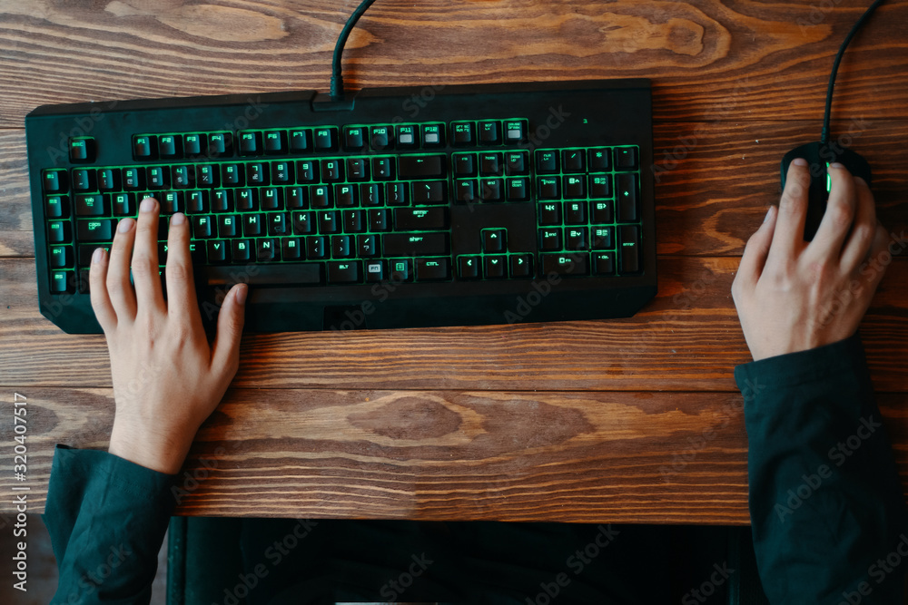
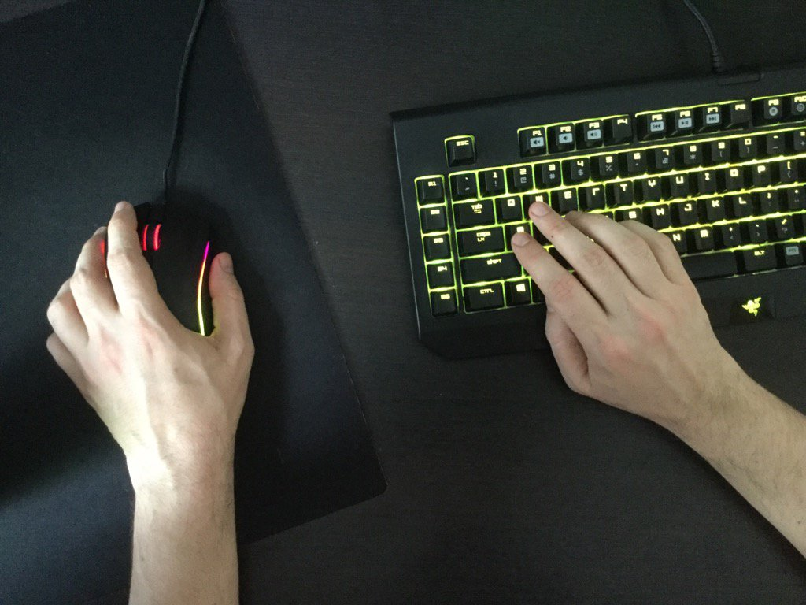

i have a problem; i am left handed. while the problem is not being left handed
in itself, it sure does arise from it. see the pc gaming controls are designed
for right handed people.

 

 

see how naturally the hands position themselves. no weird angles, just plain
ol' hands. but it feels natural to me to control the mouse with my dominant
(aka left) hand, and that forces a weird and awkward position (something like
below)

 

 

i tried playing with controllers (ADD CTONROELRRS IMAGE HERE) but that felt
like i was not given the full controls. the mouse alone has so much
significance, specially in games where you have to aim, that a controller (even
with the gyro) cant replace it.

 

as a student of computer science and electronics, i feel like im in the perfect
place to be creating something like a mouse glove for myself, i mean that's
what engineers (im not legally allowed to call myself that btw) do right? so i
too will take a shot at fixing a niche problem when better, more elegant and
effective solutions exist.
